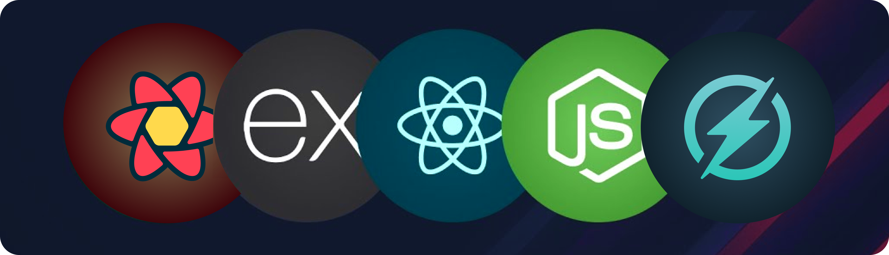

<h1 align="center">Game Deck</h1>

<p align="center">
Your Next Gaming Adventure
</p>

<p align=center>
  
<p>

<div align= "center">

[](https://twitter.com/yntpdotme) &nbsp; [](https://www.linkedin.com/in/yntpdotme/) &nbsp; [](mailto:akashkadlag14@gmail.com) &nbsp; [](https://conventionalcommits.org)&nbsp; [](https://choosealicense.com/licenses/mit/)

</div>

<h2 align="center">

 &nbsp;[See it in Action](https://game-deck.vercel.app/) &nbsp;»

</h2>

<br>

<p align="center">
  <a href="#introduction"><strong>Introduction</strong></a> 
	·&nbsp;<a href="#features"><strong>Features</strong></a> 
	·&nbsp;<a href="#tech-stack"><strong>Tech Stack</strong></a>
	·&nbsp;<a href="#local-development"><strong>Development Setup</strong></a> 
	·&nbsp;<a href="#local-development"><strong>Contributing</strong></a> 
</p>

<br>

## <a name="introduction">❄️&nbsp;Introduction</a>

GameDeck is a vibrant platform that lets gamers discover, explore, and play a curated collection of games, all powered by React. Delve into the codebase to explore more.

<br>
<a href="https://game-deck.vercel.app/">
  <p align=center>
    
  <p>
</a>
<br>

## <a name="features">🔋&nbsp; Features</a>

- Organized File and Folder Structure

- Fully Responsive Design

- Well-organized & intuitive UI

- Server Side State Management & Caching using Tanstack Query.

- Client Side States Management with Zustand

- Custom Hooks for separation of concerns

- Security Measures like proxy-server with rate limiting.

- Documentation with local development setup guide.

- Dark and Light Mode

<br>

## <a name="tech-stack">⚙️&nbsp; Tech Stack</a>

- [React](https://react.dev/) – frontend

- [Chakra UI](https://www.chakra-ui.com/) – Component library

- [Tanstack Query](https://tanstack.com/query/latest) – Asynchronous State Management

- [Zustand](https://zustand-demo.pmnd.rs/) – State Management

- [Node.js](https://nodejs.org/) – JavaScript runtime

- [Express](https://expressjs.com/) – Framework

- [Git](https://git-scm.com/) – Versioning

- [Vite](https://vitejs.dev/) – Building

- [Vercel](https://vercel.com/) – Deployments

<br>

## <a name="local-development"> 🖥️&nbsp;&nbsp; Local Development</a>

0.  **Prerequisites** <br>
    Make sure you have the following installed on your machine:

    - [Git](https://git-scm.com/)
    - [Node.js](https://nodejs.org/en)
    - [pnpm](https://pnpm.io/) (Package Manager)

1.  **Clone the repository:**

    ```bash
    git clone https://github.com/yntpdotme/game-deck.git
    ```

2.  **Navigate to the project directory:**

    ```bash
    cd game-deck
    ```

3.  **Setup Proxy-Server:**

    - **Navigate to the Proxy-Server Codebase:**

      ```bash
      cd proxy-server/
      ```

    - **Install dependencies:**

      ```bash
      pnpm install
      ```

    - **Add Environment Variables:**

      Create `.env` file in the root folder and copy paste the content of `.env.sample`

      ```bash
      cp .env.sample .env
      ```

      Update credentials in `.env` with your credentials.

    - **Start the Server:**

      ```bash
      pnpm dev
      ```

    - **Explore the API:**

      Access the project APIs at the specified endpoints using [API Docs](https://api.rawg.io/docs/).

4.  **Setup Frontend:**

    - **Navigate to the Frontend Codebase:**

      ```bash
      cd client/
      ```

    - **Install dependencies:**

      ```bash
      pnpm install
      ```

    - **Add Environment Variables:**

      Create `.env` file in the root folder and copy paste the content of `.env.sample`

      ```bash
      cp .env.sample .env
      ```

      If required, update necessary credentials.

    - **Start the frontend app:**

      ```bash
      pnpm dev
      ```

    - **Open app in browser:**

      Visit [https://localhost:5173](https://localhost:5173) to access frontend.

<br>

## 🤝&nbsp;&nbsp;Contributing

Contributions are always welcome!

See [CONTRIBUTING.md](./CONTRIBUTING.md) for ways to get started.
</br></br>

## 🪪&nbsp;&nbsp; License

GameDeck is open-source under the [MIT License](./LICENSE).
Feel free to learn, add upon, and share!
